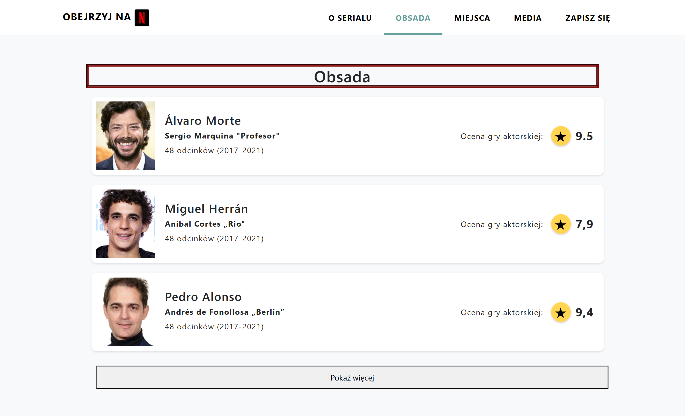
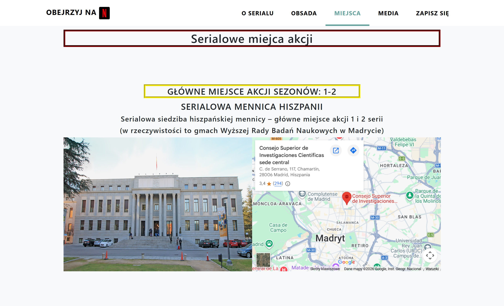

# La Casa de Papel – Projekt Webowy (2023)

Projekt strony internetowej poświęconej serialowi *La Casa de Papel*.
Zrealizowany w ramach laboratoriów z podstaw tworzenia stron internetowych (HTML, CSS, JavaScript) w 2023 roku.
---

## Zrzuty ekranu

### Podgląd aplikacji

  
  

- Ekran startowy  
- Widok listy aktorów z możliwością rozwinięcia dodatkowych informacji.

  
  

- Przykładowa lokalizacja wraz z integracją mapy  
- Formularz zapisu z walidacją i zapisem danych do `localStorage`

## Technologie

- HTML5
- CSS3 (Bootstrap 5 + własne style)
- JavaScript (Vanilla JS)
- localStorage (symulacja zapisu danych)
- Google Maps Embed API

---

## Funkcjonalności

- Responsywna nawigacja (Bootstrap)
- Sekcja obsady z dynamicznym rozszerzaniem listy
- Formularz rejestracyjny z walidacją
- Zapisywanie zgłoszeń do `localStorage`
- Edycja i usuwanie zapisanych zgłoszeń
- Możliwość wczytania danych z pliku JSON (symulacja danych z serwera)
- Dynamiczne komunikaty (alerty Bootstrap)

---

## Formularz i przechowywanie danych

Formularz zapisuje dane w `localStorage` przeglądarki.

Projekt nie posiada backendu – w momencie realizacji obejmował wyłącznie część frontendową.  
Dane z pliku `package.json` służą jako symulacja odpowiedzi serwera.

---

## Cel projektu

Celem projektu było:
- nauka semantycznego HTML
- praca z CSS i Bootstrapem
- manipulacja DOM w JavaScript
- obsługa formularzy i walidacja danych
- praca z localStorage
- organizacja struktury projektu

---

## Możliwe rozszerzenia (wersja przyszłościowa)

- Integracja z backendem (Node.js / PHP)
- Baza danych (np. MongoDB)
- Autoryzacja użytkowników
- Panel administracyjny
- Wersja SPA (React)

---

## Autor
Mateusz Bartosiewicz  